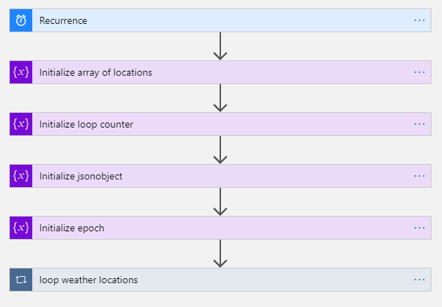
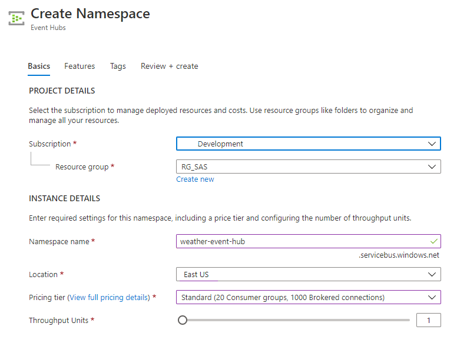
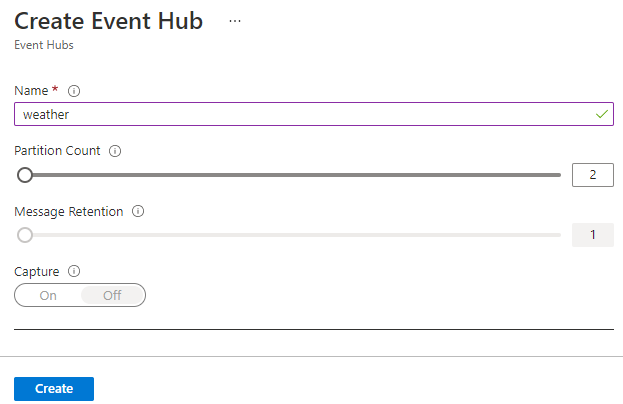
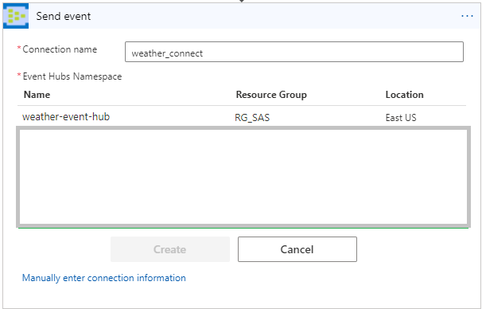
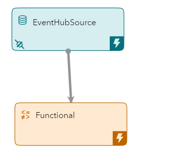
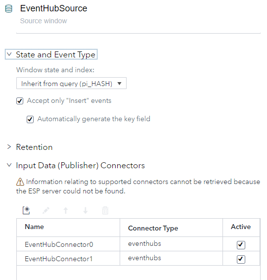
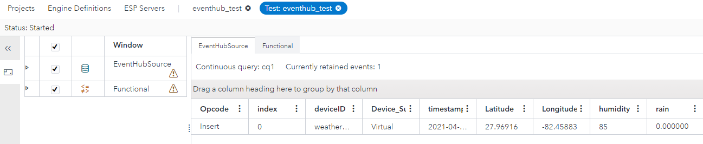

# ESP Azure Event Hub Integration

In this repository you will learn how to stream data from an Azure event hub into a [SAS Event Stream Processing](https://www.sas.com/en_us/software/event-stream-processing.html) (ESP) model using the [Azure EventHub Connector](http://pubshelpcenter.unx.sas.com:8080/test/doc/en/espcdc/v_007/espca/n1taf3y2zsqskon115o5vjbueevf.htm).

## Table of Contents
* [Prerequisites](#prerequisites)
* [Overview](#overview)
	* [Live Weather Data](#live-weather-data)
	* [Logic Application](#logic-application)
		* [Locations](#locations)
		* [Weather API key](#weather-api-key)
	* [Event Hub](#event-hub)
	* [Connecting the Logic App to the Event Hub](#connecting-the-logic-app-to-the-event-hub)
	* [ESP Project](#esp-project)
      * [EventHub Connector](#eventhub-connector)
	* [Running](#running)
* [Contributing](#contributing)
* [License](#license)
* [Additional Resources](#additional-resources)

## Prerequisites

SAS Event Stream Processing

APPID from [Azure Maps Weather service](https://docs.microsoft.com/en-us/azure/azure-maps/how-to-request-weather-data)

Azure Account

## Overview
In this project we will configure an Azure Logic application to query the Azure Maps Weather service once an hour.
The logic app will then format the data returned from the weather API into the required JSON string and send it to an Azure Event Hub.
Once in the Event Hub, it is available to other Azure resources and applications.  We will create an ESP project that receives the events from the Event Hub using the ESP Azure Event Hub Connector.  


### Live Weather Data

For this example we will work with the [Azure Maps Weather service](https://docs.microsoft.com/en-us/azure/azure-maps/how-to-request-weather-data)
which will return a JSON message in response to an API call.
Please follow the directions described on the Azure Maps web page to request a subscription key which will be used to request weather data.
An example API call might be as follows:

```
https://atlas.microsoft.com/weather/currentConditions/json?api-version=1.0&query=47.60357,-122.32945&subscription-key={Azure-Maps-Primary-Subscription-key}
```

Which would generate a JSON response such as this: 

```
{
"results": [
    {
        "dateTime": "2020-10-19T20:39:00+00:00",
        "phrase": "Cloudy",
        "iconCode": 7,
        "hasPrecipitation": false,
        "isDayTime": true,
        "temperature": {
            "value": 12.4,
            "unit": "C",
            "unitType": 17
        },
        "realFeelTemperature": {
            "value": 13.7,
            "unit": "C",
            "unitType": 17
        },
        "realFeelTemperatureShade": {
            "value": 13.7,
            "unit": "C",
            "unitType": 17
        },
        "relativeHumidity": 87,
        "dewPoint": {
            "value": 10.3,
            "unit": "C",
            "unitType": 17    ...
```

### Logic Application

Consider the following Logic application flow: 



At a high level there are three parts to this flow.  First is a timer which triggers the flow once an hour.
Next variables are initialized.
Lastly, we loop through a list of locations and issue a weather API call for each.
Since Azure is a code first environment you can easily recreate this logic application in your Azure tenant by cloning the provided example.

[Source: Logic App which retrieves weather forecasts](code/la_weather.json)

Once the logic app example is cloned into your tenant you will need to customize it to meet your location and API key.

####  Locations

Edit the location array and change these values to your latitude and longitude. 

```
{
    "name": "weather_locations",
    "type": "array",
    "value": [
      "27.96916, -82.45883"
    ]
}
```

#### Weather API key

Also edit the following key to match your subscription:
 
 ```
 "subscription-key": "<YOUR KEY HERE>"
 ```

### Event Hub

Next we need to configure an Event Hub to process events. The EventHub namespace name needs to be unique so it will be referred to as weather-event-hub but your namespace may be different.

First create the namespace.



Next create the event hub instance. 



Max message retention is 7 days.  This means you will be able to replay 7 days' worth of messages from the event hub if needed.
Increasing the partition count will increase message throughput.  Since we are only producing 1 message per hour we will leave this at the default 2.

###  Connecting the Logic App to the Event Hub

Now that we have 2 Azure resources we need to connect them together so that messages flow between them.
Navigate back to the logic application created earlier and edit the Send event action.
Create a new connection using the namespace and event hub that was just created. 



Now your LogicApp is actively issuing calls to the weather API, parsing the responses into a JSON string and sending that information to the Event Hub.
Next we configure the ESP project to retrieve the messages from the Event Hub.


### ESP Project

Our project will contain a source window which will receive events from our EventHub connector.
Source windows provide a means for ESP to ingest data.  The Source window will also parse the JSON EventHub message.  After an event is received in a source window it can be connected to other window types such as functional windows for additional processing.




####  EventHub Connector

Now to setup the EventHub Connector.  The EventHub connector subscribes to a single partition since the default EventHub has two partitions you will need to setup two EventHub connector Instances.  Each will have the same parameters except the partition id.  

Inside the Source Window create the two instances of the EventHub connector under Input Data(Publisher) Connectors:



The accept only Insert events option allows us to create an autoincrementing id for the index of events.

Let's take a closer look at the project XML to see how the connector is configured.

```
<connectors>
    <connector class="eventhubs" name="EventHubConnector0">
      <description><![CDATA[Partition 0]]></description>
      <properties>
        <property name="type"><![CDATA[pub]]></property>
        <property name="eventhubsconnectionstring"><![CDATA[Endpoint=sb://weather-event-hub.servicebus.windows.net/;SharedAccessKeyName=RootManageSharedAccessKey;SharedAccessKey=<SAS KEY>]]></property>
        <property name="eventhubspath"><![CDATA[weather]]></property>
        <property name="eventhubsconsumergroup"><![CDATA[$default]]></property>
        <property name="eventhubspartition"><![CDATA[0]]></property>
        <property name="eventhubsformat"><![CDATA[json]]></property>
      </properties>
    </connector>
    <connector class="eventhubs" name="EventHubConnector1">
      <description><![CDATA[Partition 1]]></description>
      <properties>
        <property name="type"><![CDATA[pub]]></property>
        <property name="eventhubsconnectionstring"><![CDATA[Endpoint=sb://weather-event-hub.servicebus.windows.net/;SharedAccessKeyName=RootManageSharedAccessKey;SharedAccessKey=<SAS Key>]]></property>
        <property name="eventhubspath"><![CDATA[weather]]></property>
        <property name="eventhubsconsumergroup"><![CDATA[$default]]></property>
        <property name="eventhubspartition"><![CDATA[1]]></property>
        <property name="eventhubsformat"><![CDATA[json]]></property>
      </properties>
    </connector>
  </connectors>
```

| Property | Explaination | 
|----------|---------------|
| type | 'pub' to receive message in project |
| eventhubconnectionstring | The connection string of your event hub, from the EventHub namespace |
| eventhubspath | name of the EventHub instance inside your EventHub namespace |
| eventhubsconsumergroup | name of the consumer group to receive the data |
| eventhubspartition | id of the partition to read from, 0 is the first partition |
| eventhubsformat | json, csv, or avro |


Each consumer group maintains state and an offset into the eventhub's partitions to determine messages that have been read.  It is recommended that there is only one active receiver per consumer group.  You should create additional consumer groups for each active ESP project.

For more on Azure Event Hub features please consult: [Microsoft: Features and terminology in Azure Event Hubs](https://docs.microsoft.com/en-us/azure/event-hubs/event-hubs-features)

Once the connector is created the schema for the source window must be specified.  This is the body of the EventHub message.  You can import it with the following xml:
```
 <schema>
    <fields>
      <field name="index" type="int64" key="true"/>
      <field name="deviceID" type="string"/>
      <field name="Device_Subtype" type="string"/>
      <field name="timestamp" type="stamp"/>
      <field name="Latitude" type="string"/>
      <field name="Longitude" type="string"/>
      <field name="humidity" type="int32"/>
      <field name="rain" type="double"/>
      <field name="rainplus1" type="double"/>
      <field name="rainplus2" type="double"/>
      <field name="rainplus3" type="double"/>
      <field name="rainplus4" type="double"/>
      <field name="rainplus5" type="double"/>
      <field name="rainplus6" type="double"/>
      <field name="rainprobability" type="double"/>
      <field name="rainprobabilityplus1" type="double"/>
      <field name="rainprobabilityplus2" type="double"/>
      <field name="rainprobabilityplus3" type="double"/>
      <field name="rainprobabilityplus4" type="double"/>
      <field name="rainprobabilityplus5" type="double"/>
      <field name="rainprobabilityplus6" type="double"/>
      <field name="temperature" type="double"/>
      <field name="temperatureplus1" type="double"/>
      <field name="temperatureplus2" type="double"/>
      <field name="temperatureplus3" type="double"/>
      <field name="temperatureplus4" type="double"/>
      <field name="temperatureplus5" type="double"/>
      <field name="temperatureplus6" type="double"/>
      <field name="windspeed" type="double"/>
      <field name="type" type="string"/>
      <field name="location" type="string"/>
    </fields>
  </schema>
```

**Note** There are examples of configuration files with matching models for you to use in the [code](/code) directory.

### Running

Once the project is ready, you can run it using ESP Studio Test Run feature or deploying it to an ESP Server.  If you monitor the events from the Source window you should see something that looks like: 



One useful feature of Logic Apps is the run on demand feature.  You can use this to trigger the logic app to retrieve the weather forecast at anytime and then watch the ESP event get generated immediately.


## Contributing

> We welcome your contributions! Please read [CONTRIBUTING.md](CONTRIBUTING.md) for details on how to submit contributions to this project. 

## License

> This project is licensed under the [Apache 2.0 License](LICENSE).

## References:
* [SAS Event Stream Processing](https://www.sas.com/en_us/software/event-stream-processing.html)
* [Azure EventHub Connector](http://pubshelpcenter.unx.sas.com:8080/test/doc/en/espcdc/v_007/espca/n1taf3y2zsqskon115o5vjbueevf.htm)
* [Microsoft: Features and terminology in Azure Event Hubs](https://docs.microsoft.com/en-us/azure/event-hubs/event-hubs-features)
